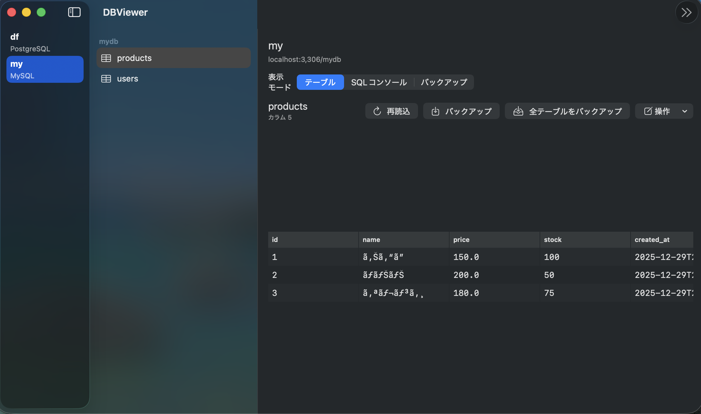
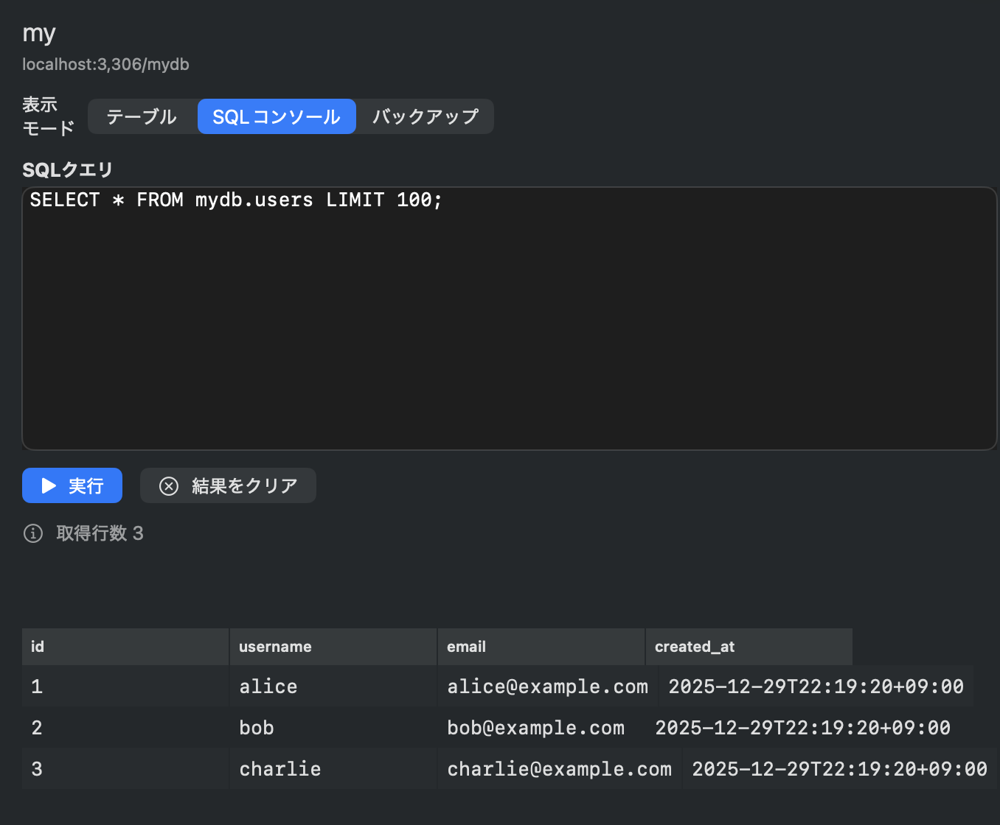
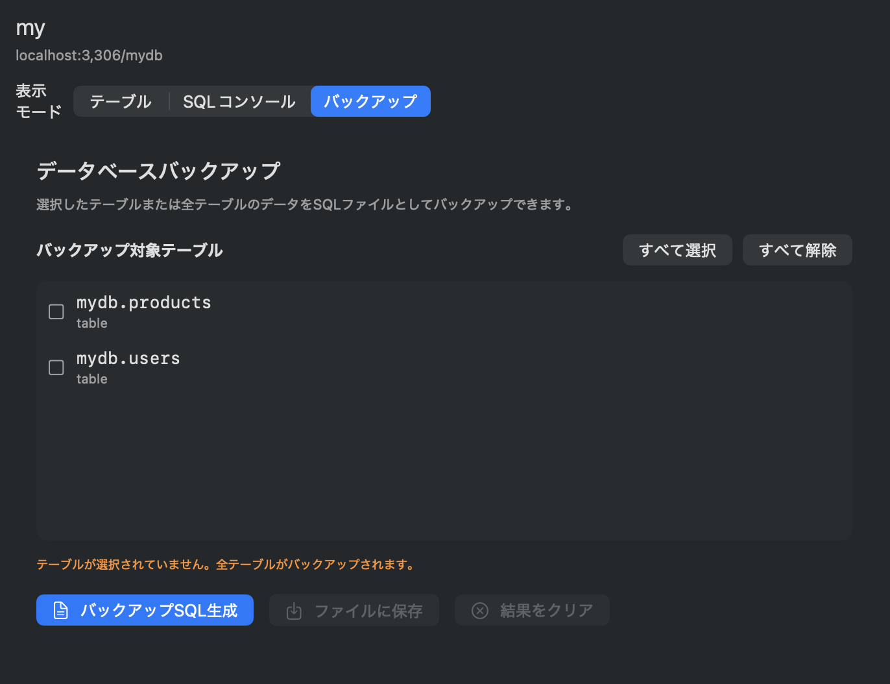

# DB Viewer

<p align="center">
  
</p>

macOS 向けのデータベースビューアアプリケーションです。PostgreSQL、MySQL、SQLite をサポートしています。

## 主な機能

### テーブルビュー
データベースのテーブルデータを一覧表示します。左側のサイドバーでスキーマとテーブルを選択し、右側でデータの閲覧・編集が可能です。フィルタリング、ソート、ページングにも対応しています。



### SQLコンソール
任意のSQLクエリを直接実行し、結果をグリッド形式で確認できます。複雑なJOINや集計クエリなど、自由にSQLを記述して実行できます。



### バックアップ
選択したテーブルまたは全テーブルのデータをSQL形式（CREATE TABLE + INSERT文）でエクスポートできます。データの移行やバックアップに便利です。



### その他の機能
- **マルチデータベース対応**: PostgreSQL、MySQL、SQLite の3つのデータベースエンジンに対応
- **接続管理**: 複数のデータベース接続を保存・管理
- **セキュアな資格情報管理**: パスワードはmacOS Keychainに安全に保存
- **オプティミスティックロック**: 安全なデータ編集（競合検知）

## 必要環境

- macOS 13.0 以上
- Swift 6.2 以上
- Xcode 16.0 以上（開発時）

## インストール

### ソースからビルド

```bash
# リポジトリをクローン
git clone https://github.com/yuorei/db-viewer-mac.git
cd db-viewer-mac

# ビルド
swift build

# 実行
swift run db-viewer
```

### Makefile を使用

```bash
# Debug ビルド
make build

# Release ビルド
make release

# macOS アプリバンドル作成（build/DBViewer.app）
make app

# 実行
make run
```

## 使い方

### 1. 接続の追加

アプリケーション起動後、「+」ボタンをクリックして新しいデータベース接続を追加します。

| データベース | 設定項目 |
|------------|---------|
| PostgreSQL | ホスト、ポート（デフォルト: 5432）、データベース名、ユーザー名、パスワード、TLS設定 |
| MySQL | ホスト、ポート（デフォルト: 3306）、データベース名、ユーザー名、パスワード、TLS設定 |
| SQLite | データベースファイルのパス |

### 2. データの操作

- **閲覧**: 左側のサイドバーでテーブルを選択
- **フィルタリング**: カラムごとに条件を指定してデータを絞り込み
- **ソート**: カラムヘッダーをクリックして昇順/降順でソート
- **追加**: 「+」ボタンで新しい行を追加
- **編集**: 行をダブルクリックして値を編集
- **削除**: 行を選択して削除ボタンをクリック

## アーキテクチャ

```
db-viewer/
├── Sources/
│   ├── DBViewerCore/          # コアライブラリ
│   │   ├── DatabaseDriver.swift      # ドライバプロトコル
│   │   ├── DatabaseModels.swift      # データモデル
│   │   ├── RealDatabaseDrivers.swift # DB ドライバ実装
│   │   ├── StubDrivers.swift         # テスト用スタブ
│   │   ├── ConnectionStore.swift     # 接続情報の永続化
│   │   └── KeychainService.swift     # Keychain 統合
│   └── DBViewerApp/           # SwiftUI アプリケーション
│       ├── DBViewerApp.swift         # エントリーポイント
│       ├── *ViewModel.swift          # ビューモデル (MVVM)
│       ├── *View.swift               # SwiftUI ビュー
│       └── AppDependencies.swift     # 依存性注入
├── Package.swift
└── Makefile
```

### 主要なデザインパターン

- **MVVM**: SwiftUI + ViewModel によるUI設計
- **Protocol-Oriented**: `DatabaseDriver`/`DatabaseSession` プロトコルによる抽象化
- **Dependency Injection**: `AppDependencies` による依存性管理
- **Optimistic Locking**: データ編集時の競合検知

## 対応データベース

| データベース | 接続 | スキーマ閲覧 | データ閲覧 | データ編集 | バックアップ |
|------------|------|------------|----------|----------|------------|
| SQLite     | ○   | ○          | ○        | ○        | ○          |
| PostgreSQL | ○   | ○          | ○        | ○        | ○          |
| MySQL      | ○   | ○          | ○        | ○        | ○          |

## 開発

### テストの実行

```bash
swift test
# または
make test
```

### PostgreSQL/MySQL 接続テスト

```bash
# PostgreSQL 接続テスト
swift run PostgresTest

# MySQL 接続テスト
swift run MySQLTest
```

### クリーンビルド

```bash
make clean
swift build
```

## 依存ライブラリ

- [postgres-nio](https://github.com/vapor/postgres-nio) - PostgreSQL ドライバ
- [mysql-nio](https://github.com/vapor/mysql-nio) - MySQL ドライバ
- SQLite3 (macOS 標準ライブラリ)

## ライセンス

このプロジェクトは [MIT License](LICENSE) の下で公開されています。

## 貢献

Issue や Pull Request は歓迎します。大きな変更を行う場合は、事前に Issue で議論をお願いします。
